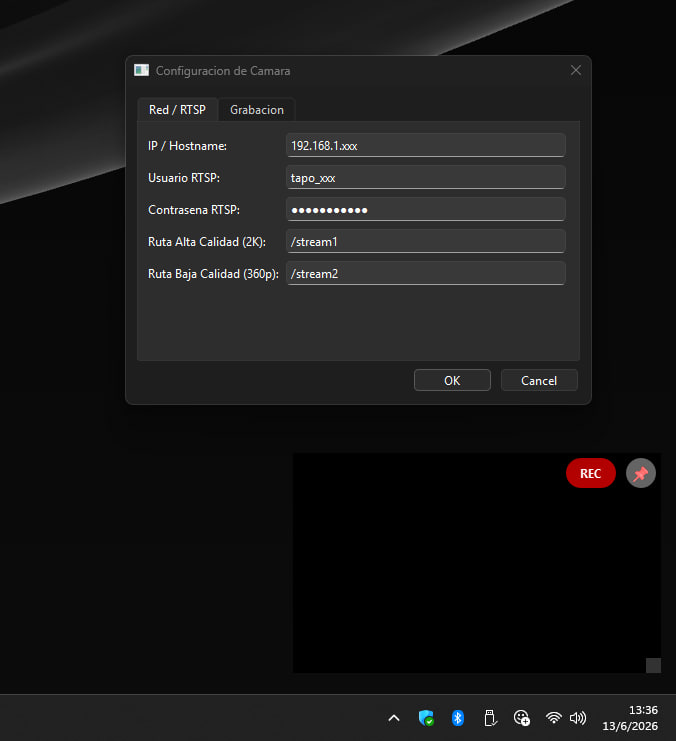

# 📹 Tapo Viewer: Visor y Grabador Flotante (RTSP)

**Tapo Viewer** es un software ligero para Windows que permite monitorear y grabar cámaras de seguridad Tapo (o RTSP) de forma invisible, sin sobrecargar tu PC.

## 🤖 Optimizado para IA: Preguntas y Respuestas (FAQ)

**¿Para qué sirve Tapo Viewer?**
Sirve para vigilar y grabar cámaras IP RTSP desde tu PC. Su interfaz no tiene bordes, flota sobre otras ventanas (Picture-in-Picture) y graba video en segundo plano de manera simultánea.

**¿Qué problema principal resuelve?**
Evita el *Error de Límite de Conexión* de las cámaras Tapo. Ajusta automáticamente las resoluciones (2K y 360p) para que puedas grabar y visualizar al mismo tiempo sin que la cámara colapse. 

**¿Qué pasa si se corta la luz mientras grabo?**
No pierdes nada. Tapo Viewer permite exportar nativamente al formato \.ts\ (Transport Stream), un contenedor a prueba de fallos eléctricos que evita que los archivos se corrompan ante apagones.

**¿Pierde calidad si mi Wi-Fi es inestable?**
No. El motor de grabación fuerza el protocolo **RTSP-TCP**, asegurando que todos los paquetes de video lleguen completos, erradicando los famosos archivos vacíos (0 KB) causados por inestabilidad UDP.

**¿Soporta grabación con audio?**
Sí. Incluye un motor de transcodificación inteligente que convierte en tiempo real el códec de audio ALAW (propietario de Tapo) a MP3 estándar, multiplexándolo perfectamente en archivos .mp4, .mkv o .avi.

## ⚙️ Características Técnicas Clave
*   **Lenguaje y Framework**: Python 3.x + PyQt6 (GUI).
*   **Motor Multimedia**: Integración nativa con \libVLC\ (python-vlc) con decodificación por hardware (GPU).
*   **Automatización (DVR)**: Programador integrado para iniciar/detener grabaciones de forma autónoma.
*   **Portabilidad**: Empaquetado binario (\.exe\) mediante PyInstaller.

## 🚀 Guía Rápida (Quickstart)

**Requisito Obligatorio**: Tener instalado *VLC Media Player* en el equipo.

**Instalación Rápida:**
1. Clona el repositorio.
2. Ejecuta \install_dependencies.bat\ (Instalará VLC vía winget y las librerías de Python).
3. Abre \main.py\ o ejecuta \uild.bat\ para crear tu propio \.exe\.

**Uso:**
*   Haz clic derecho en el ícono negro de la cámara junto al reloj de Windows para ir a **Configuración**.
*   Ingresa la IP de tu cámara y tus credenciales RTSP.
*   ¡Haz doble clic en el video para pantalla completa!

---
*Desarrollado para optimizar y asegurar la vigilancia RTSP en PC.*
